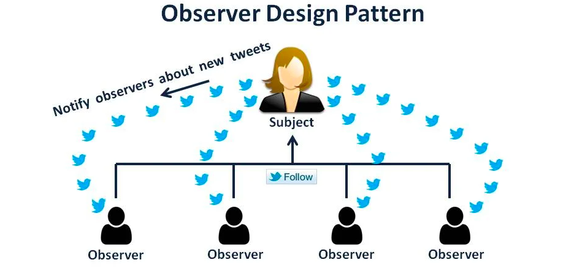

# Observer Pattern

The Observer Pattern is a behavioral design pattern that establishes a one-to-many dependency between objects. It allows a single object, known as the *subject*, to maintain a list of *observers* that are automatically notified whenever the subject’s state changes. This keeps observers synchronized with the subject without requiring them to actively query it.

This pattern is ideal for scenarios where multiple components need to be updated automatically in response to changes in a single, central object, making it useful for designing reactive and modular systems.

## 📘 Definition
The Observer Pattern allows an object (the *subject*) to notify multiple dependent objects (the *observers*) about state changes. By creating this one-to-many dependency, observers can automatically stay up-to-date with the subject’s state.

## ✨ Key Features

- **One-to-Many Relationship**: This pattern supports a one-to-many relationship where a single subject can have multiple observers. Any change in the subject’s state triggers an update to all observers, who can then respond accordingly.

- **Loose Coupling**: Observers and the subject are loosely coupled, meaning the subject doesn’t need to know specifics about the observers. Observers subscribe to the subject for updates, and each can process updates independently.

- **Automatic Updates**: When the subject's state changes, all registered observers are automatically notified, allowing them to stay in sync without constant monitoring.

- **Open for Extension, Closed for Modification**: This pattern enables adding or removing observers dynamically without altering the subject’s code. This supports the "open/closed" principle, allowing new observers to be added without modifying core logic.

## 🎯 Benefits

- **Consistency Across Dependents**: Observers receive updates in real time, ensuring all dependent objects have the latest information upon any change in the subject's state.

- **Modularity and Scalability**: The pattern enables easy addition or removal of observers without modifying the subject’s core logic, supporting system growth as more observers subscribe when needed.

- **Separation of Concerns**: Observers handle their own updates, allowing the subject to focus solely on managing its state. This separation enhances code clarity and reduces error risks.

- **Reduced Maintenance Costs**: Thanks to loose coupling, changes in the subject or an observer don’t directly impact each other, making the codebase easier to maintain and extend.

---

## 🔄 Similarity to the Publish/Subscribe Pattern

The Observer Pattern is often compared to the *Publish/Subscribe* (or *Pub/Sub*) pattern, as both facilitate communication between objects. Here are some key similarities and differences:

- **Similarities**: Both patterns allow multiple components to receive updates based on events. In both patterns, components register their interest to be notified of specific changes.

- **Differences**: In the Observer Pattern, observers are directly linked to the subject, making it suitable for cases where the subject needs to notify specific observers directly.
In contrast, Publish/Subscribe introduces a messaging broker or event bus to decouple publishers and subscribers further.
The observer pattern is mostly implemented synchronously, i.e. the Subject calls the appropriate method of all its observers when an event occurs. The publisher-subscriber pattern is mostly implemented asynchronously (using a message queue).
This makes Pub/Sub more scalable and ideal for distributed systems, while the Observer Pattern is often used within a single application.
